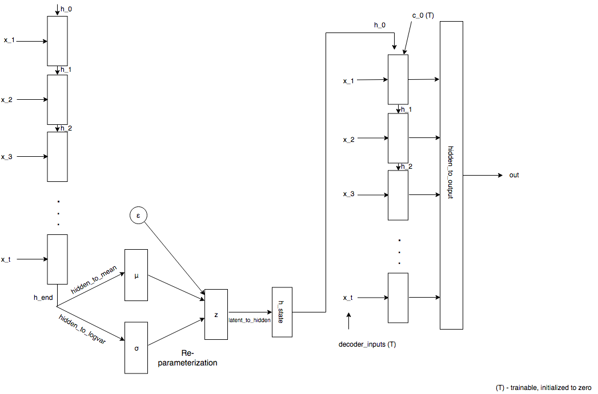

## Dynamic VAE frame

 1. Automatic feature extraction can be achieved by probability distribution of battery data  

> The application of data science method to anomaly discrimination in time series is limited.  The main reason is that exception tags are usually few in quantity, low in quality, mismarked or omitted.  In order to solve this problem, we hope to process a large number of time series data that have not been manually filtered through the compilation and interpretation model related to information theory and the use of large-scale networks (such as Transformer) to parameterize the probability distribution of data and the correlation function on each feature.  
> The parameters and network structure acquired by learning contain highly nonlinear features that are difficult to be extracted artificially, which can help existing models to achieve better performance in anomaly and health prediction tasks.  

 2. A simple model is used to detect anomalies in extracted features
## Purpose of model
 1. For feature extraction of battery data

 2. According to the extracted features, the anomaly detection model is learned.

## How to get data
```python
cd DATASET/dataset
wget http://82.156.209.173/s/6Saazbbxq92iez7/download
unzip download
cd Dataset/dahu
tar -xf test_mulmileage.tar
```
You can download and decompress the files to the DATASET/dataset directory according to the provided data link, put the data folder in the DATASET subdirectory.
### How to run：
```python
python train.py
```
